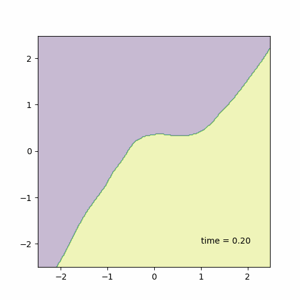

# Continuous Temporal Domain Generalization

This repository contains the official implementation of the paper **"Continuous Temporal Domain Generalization"** submitted to NeurIPS 2024.

## Introduction

Temporal Domain Generalization (TDG) addresses the challenge of training predictive models under temporally varying data distributions. Traditional TDG approaches typically focus on domain data collected at fixed, discrete time intervals, which limits their capability to capture the inherent dynamics within continuous-evolving and irregularly-observed temporal domains. This work formalizes the concept of Continuous Temporal Domain Generalization (CTDG), where domain data are derived from continuous times and are collected at arbitrary times.

We propose a Koopman operator-driven continuous temporal domain generalization (Koodos) framework. This framework leverages Koopman theory to learn the underlying dynamics and optimizes generalization across continuous temporal domains.

## Usage

To train and evaluate the model, please run:
```bash
python ./code/{dataset}.py
```

## Results

The results of our experiments demonstrate the effectiveness and efficiency of our approach. We show detailed results on the 2-Moon Dataset.

1. **Prediction Results on Test Domains:**
   This figure shows the prediction results on the test domains. It illustrates how well the model generalizes to unseen data points in the 2-Moon dataset.
   
   

2. **Interpolation Model:**
   These figures show the interpolation of the predictive model. It visualizes how the model predicts intermediate states between observed domains, showing the smooth transition and generalization capabilities.
   
   

3. **Extrapolation Model:**
   This figure shows the extrapolation of predictive model parameters in t-SNE space. It visualizes how the model predicts future states beyond the observed domains, indicating its ability to generalize over continuous time.
   
   
